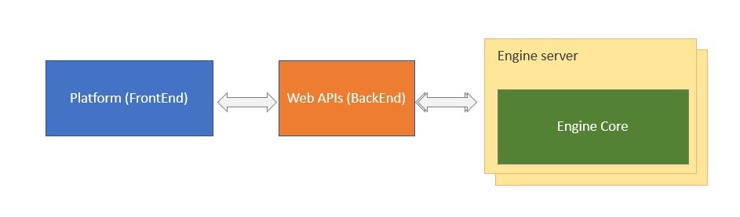

# tradeblocks-engine-core

## TradeBlocks Platform 

## Application
It is a web platform which provides a low-code user interface for the user to program trading robots for financial markets. 

After programing the robot through our interface we compile that to the target language which is MQL5.

Platform:

Formula Designer:

## This repository
This repository contains the core code (Engine Core) which works like a "library" its reponsible to materialize the workflow in executable code (target language which is MQL5), the whole code can be found in `/engine-core`.

__Quick Note:__ Currently FrontEnd and BackEnd is made on PHP using CodeIgniter and the core part (engine-core) is already migrated to Java, now the PHP application is calling a web service provided by engine-server.

The "Engine Core" runs in "Engine Server" which is basically a Spring Boot server providing the core as a web service.

We can see it working by running the test class `ComposerTest` which uses `simple_flow.json` as input file (The same data that comes from the FrontEnd).

## Overview:

Every "project" follows this basic structure:

Have at least a:
- Workflow
    
That can contain multiple:
- Blocks
    
Each block can have:
- Connectors
- Parameters

Workflow should look like:

If we go to "Setup of Parameters":

Design formula would jump to "Formula Designer"

